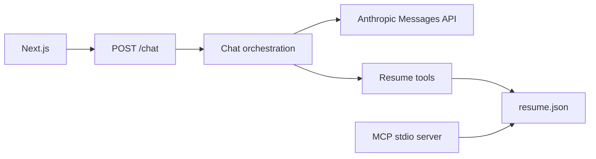

# zachsykes.dev

Portfolio site for Zach Sykes. The public UI is a Next.js application. Questions about background are answered by a streaming chat whose resume data, system prompt, and tool loop live in an ASP.NET Core API.

**Live:** [zachsykes.dev](https://zachsykes.dev)

[](https://github.com/Calathea-Z/portfolio_ai/actions/workflows/ci.yml)

## What the site does

- Home page with current work, featured projects, experience, and contact.
- Streaming chat. The model calls seven resume tools, and the transcript shows those calls.
- Resume page, plus a downloadable PDF at `web/public/Sykes_Zach_Resume_Default.pdf`.
- Project pages for budgeting, Planning Poker, the agentic chat, and the MCP server.
- A local [Model Context Protocol](https://modelcontextprotocol.io) server that exposes the same seven tools over stdio.
- Deterministic chat evals. Checked-in results render on `/projects/agentic-chat`.

The tools are `get_role`, `search_resume`, `list_projects_by_skill`, `get_metrics`, `list_recent_shipped`, `get_narrative`, and `get_faq`. Definitions live in `api/Portfolio.Api/Services/ResumeToolDefinitions.cs`. The MCP server uses the same names and input schemas. `McpToolInputSchemaParityTests` fails the build if those contracts drift.

## Use it as your own site

This repository is the source for zachsykes.dev. The checked-in copy describes Zach Sykes: his roles, projects, contact links, and the voice of the chat. Replace that content with your own before you publish a fork. Cloning the repo and starting the servers leaves the site and the chat speaking as him.

| Replace | Where |
|---------|--------|
| Resume the chat and MCP server read | `api/Portfolio.Api/Data/resume.json` |
| Chat voice, scope, and contact rules | `api/Portfolio.Api/Prompts/chat.md` |
| Name, positioning, city, and contact links | `web/lib/site-config.ts` |
| Featured projects and repository links | `web/lib/projects.ts` |
| Homepage, resume page, and project write-ups | `web/components/sections/`, `web/app/resume/page.tsx`, `web/app/projects/` |
| Downloadable PDF | A file under `web/public/`. Point `siteConfig.resume` and the links inside `resume.json` at that file. |
| Browser title and social preview | `web/app/layout.tsx` |
| Allowed browser origins | `Cors:AllowedOrigins` in `api/Portfolio.Api/appsettings.json` |

`resume.json` and `chat.md` are embedded in the API assembly. Restart the API after editing them. The MCP server reads whatever file you pass with `--data`; point that flag at your resume.

`evals/cases.json` and parts of `api/Portfolio.Api.Tests` expect facts from this resume, including employers, project names, and URLs. Update those expectations to match your data, then run the tests and the evals again.

## Architecture

The browser posts the conversation to `POST /chat`. The API streams newline-delimited JSON, calls the Anthropic Messages API, and runs tool requests against `api/Portfolio.Api/Data/resume.json`. That file and the system prompt in `api/Portfolio.Api/Prompts/chat.md` are embedded in the API assembly.



`POST /internal/chat-evals` uses the same stream for the eval runner. Until `Eval:ApiKey` is set, that route returns 404. With the key set, the caller sends it in the `X-Eval-Key` header.

In Development, Swagger UI is at `/swagger`. Each client IP has a short request window and a daily token budget, configured under `ChatProtection` in `api/Portfolio.Api/appsettings.json`.

## Stack

| Area | Choice |
|------|--------|
| Web | Next.js 16, React 19, TypeScript, Tailwind CSS 4 |
| API | ASP.NET Core on .NET 8 |
| Model | Anthropic Messages API (`Anthropic:Model` in configuration) |
| MCP | Node.js stdio server (`@modelcontextprotocol/sdk`) |
| API tests | xUnit |
| CI | GitHub Actions on pushes to `main` and on pull requests |

The web package and the MCP package are marked private and are not published to npm.

## Repository layout

| Path | Purpose |
|------|---------|
| `web/` | Next.js application. Install and run it with pnpm. |
| `api/Portfolio.Api/` | Chat API, resume data, and system prompt. |
| `api/Portfolio.Api.Tests/` | API tests. |
| `mcp/` | Resume MCP server. See [`mcp/README.md`](mcp/README.md). |
| `evals/` | Live eval runner. See [`evals/README.md`](evals/README.md). |
| `Portfolio.slnx` | Solution for the API and its tests. |
| `.github/workflows/ci.yml` | API build and tests, then web lint, typecheck, and production build. |

## Prerequisites

- [.NET 8 SDK](https://dotnet.microsoft.com/download/dotnet/8.0)
- [Node.js 20](https://nodejs.org/) or newer
- [pnpm 10](https://pnpm.io/installation), matching CI
- An Anthropic API key, required to start the API

## Run locally

The API refuses to start until `Anthropic:ApiKey` is set. Keep the key in user secrets or in the environment variable `Anthropic__ApiKey`.

```powershell
cd api\Portfolio.Api
dotnet user-secrets set "Anthropic:ApiKey" "<your-anthropic-api-key>"
dotnet run --launch-profile http
```

The `http` profile listens on [http://localhost:5063](http://localhost:5063). Swagger UI is at [http://localhost:5063/swagger](http://localhost:5063/swagger).

In a second terminal:

```powershell
cd web
pnpm install
pnpm dev
```

Open [http://localhost:3000](http://localhost:3000). On localhost, the browser calls `http://localhost:5063` when `NEXT_PUBLIC_CHAT_API_URL` is unset.

`Cors:AllowedOrigins` already includes `http://localhost:3000`. Add any other UI origin there before calling the API from that host.

## Configuration

Committed API settings live in `api/Portfolio.Api/appsettings.json`.

| Setting | Purpose |
|---------|---------|
| `Anthropic:ApiKey` | Required at startup. User secret, or `Anthropic__ApiKey`. |
| `Anthropic:Model` | Messages API model id. |
| `Cors:AllowedOrigins` | Browser origins allowed to call the API. |
| `ChatProtection` | Per-IP request limit and daily token budget. |
| `Eval:ApiKey` | Shared secret for `POST /internal/chat-evals`. Set it only when running evals. |

Web overrides go in `web/.env.local`, which is gitignored. Local `pnpm dev` on localhost works with the defaults below.

| Variable | Default |
|----------|---------|
| `NEXT_PUBLIC_CHAT_API_URL` | `http://localhost:5063` for a localhost page. Set this for any other host, and for a production build, so the client and the Content-Security-Policy both allow the API origin. |
| `NEXT_PUBLIC_RESUME_PDF_URL` | `/Sykes_Zach_Resume_Default.pdf` |
| `NEXT_PUBLIC_GITHUB_URL` | `https://github.com/Calathea-Z` |
| `NEXT_PUBLIC_LINKEDIN_URL` | Value in `web/lib/site-config.ts` |
| `NEXT_PUBLIC_CONTACT_EMAIL` | Value in `web/lib/site-config.ts` |
| `NEXT_PUBLIC_PORTFOLIO_SITE_URL` | `https://www.zachsykes.dev/` |

## Tests

From the repository root:

```powershell
dotnet test Portfolio.slnx
```

From `web/`:

```powershell
pnpm lint
pnpm typecheck
pnpm build
```

CI runs the API build and tests, then those three web checks. Refresh the eval table by following [`evals/README.md`](evals/README.md) and committing the updated `evals/results.json`. Build and register the MCP server from [`mcp/README.md`](mcp/README.md).

## Routes

| Path | Page |
|------|------|
| `/` | Home |
| `/chat` | Chat |
| `/resume` | Resume |
| `/projects/budgeting` | Budgeting and debt planning |
| `/projects/planning-poker` | Planning Poker |
| `/projects/agentic-chat` | Agentic chat and eval results |
| `/projects/mcp-server` | MCP server |
